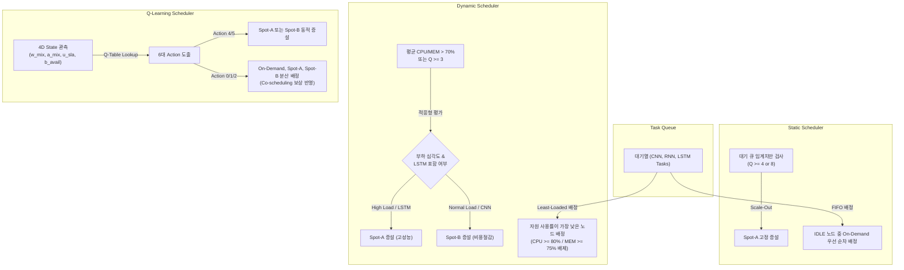

# WE-MEET 3대 스케줄러 비교 및 차별화 기술 명세서 (Scheduler Specification)

본 문서는 WE-MEET 클러스터 제어 엔진에 구현된 3대 스케줄러 모드(**Static**, **Dynamic**, **Q-Learning**)의 구체적인 제어 설계 차이점을 기술하고, 각 모드가 요금-성능-가용성 측면에서 실질적으로 차별화된 거동을 보이도록 정립한 스펙 명세서입니다.

특히, **Dynamic 스케줄러**의 고정 증설 문제를 해결하기 위해 **부하/워크로드 적응형 인스턴스 기동 정책**을 설계하여 정적 룰 및 강화학습(Q-Learning)과의 차별성을 극대화합니다.

---

## 1. 3대 스케줄러 동작 비교 요약

| 스케줄러 모드 | 의사결정 기법 | 자원/부하 인지 | 인스턴스 타입 제어 | SLA/비용 인지 | 백필링 (Backfilling) |
| :--- | :--- | :--- | :--- | :--- | :--- |
| **Static 스케줄러** | 정적 임계치 룰 | 없음 (단순 FIFO) | **Spot-A 단일 타입 고정** | 없음 (가상 예산 무시) | 미지원 |
| **Dynamic 스케줄러** | 부하 피드백 제어 | Least-Loaded 및 과부하 회피 | **부하/모형 적응형 이종 증설** | 없음 (성능 극대화 중심) | 지원 (자원 부족 시 비순차 배정) |
| **Q-Learning 스케줄러** | 강화학습 정책 수렴 | 상태 전이 (4차원) 및 Co-scheduling | **RL 기반 최적 혼합 증설** | **있음** (비용-지연 균형 최적화) | **지원** (HOL Blocking 원천 해소) |

---

## 2. 각 스케줄러별 상세 제어 메커니즘 설계

### 가. Static (정적 규칙 기반) 스케줄러
가장 단순한 형태의 규칙 기반 스케줄러로, 시스템 메트릭이나 요금을 배제하고 오직 **큐 크기**라는 단일 지표만을 활용합니다.
*   **자원 배정**: 대기열의 최선두 작업을 꺼내어, 가용한(IDLE) 워커 중 온디맨드(`worker-1`)를 최우선으로 배치하고 없으면 스팟 노드에 순차 배정합니다.
*   **스케일아웃 조건**: 대기열 크기가 `4` 이상이면 Spot-A 1대 증설, `8` 이상이면 Spot-A 2대를 동시 증설합니다.
*   **스케일인 조건**: 대기열이 비어 있는 상태가 `3.0초` 이상 지속되면 가동 중인 Spot-A 워커를 순차적으로 회수합니다.
*   **차별화 지점**: **Spot-B 노드는 스케일 대상에서 완전히 제외**되며 오직 Spot-A만 다룹니다. 자원 격리 상태를 모니터링하지 않으므로 자원 간섭(Interference)에 무방비합니다.

### 나. Dynamic (동적 부하 인지형) 스케줄러
클러스터의 CPU/메모리 부하 상태를 실시간 피드백 받아 자원 경합을 회피하고 가용성을 높이며, **고정 증설 대신 적응형 인스턴스 선택**을 지원하도록 고도화합니다.
*   **자원 배정 (Least-Loaded / Spread)**: 가용한 IDLE 워커들 중 `CPU 사용률 * 0.5 + 메모리 사용률 * 0.5` 합산 수치가 가장 낮아 여유로운 노드에 작업을 배정(Spread)합니다.
*   **간섭 회피 (Staggered Scheduling)**: 특정 워커의 CPU가 `80%` 이상이거나 메모리가 `75%` 이상으로 포화 상태일 경우 해당 노드를 배정 후보에서 강제 배제합니다.
*   **부하/모형 적응형 스케일아웃**:
    *   스케일아웃 조건 만족 시(대기 큐 임계치 초과 또는 평균 부하 > 70%), 인스턴스 타입을 동적으로 결정합니다.
    *   **Spot-A(고성능) 증설 조건**: 현재 평균 CPU/Memory 사용률이 `75%`를 초과하여 연산 가속이 급박하거나, 대기열 내에 메모리 집약형 모형인 **`LSTM` 작업이 포함**되어 있을 경우.
    *   **Spot-B(저비용) 증설 조건**: 그 외의 일반 적체 상황이거나 큐에 상대적으로 가벼운 CNN, RNN 위주의 작업만 존재할 경우.
*   **스케일인 정책**: 대기열이 비어 있고, 평균 CPU/Memory 사용률이 동시에 `20% 미만`으로 3.0초 이상 유지될 때, 가동 요금이 비싼 **Spot-A를 최우선 회수**하고 없으면 Spot-B를 회수합니다.
*   **차별화 지점**: 예산(Budget) 개념은 보지 않으나, **시스템의 물리적 부하 수준 및 ML 모형 요구사항에 맞춰 스팟 노드 종류를 헤리스틱 규칙에 의해 가변 기동**합니다.

### 다. Q-Learning (강화학습 인지형) 스케줄러
가장 고도화된 스케줄러로, 예산 제약과 SLA 마감이라는 트레이드오프 상황을 학습을 통해 극복합니다.
*   **4차원 상태 파악**: 큐에 쌓인 모형 유형($w_{mix}$), 가용 노드 조합 비트맵($a_{mix}$), SLA 임박도($u_{sla}$), 남은 예산 가용도($b_{avail}$)를 종합하여 현재 환경 상태를 관측합니다.
*   **6대 행동 선택**:
    *   `Action 0~2`: On-Demand, Spot-A, Spot-B 노드로 각각 배정
    *   `Action 3`: Hold (비용 보존을 위해 배정을 일시 보류하고 대기)
    *   `Action 4~5`: Spot-A 혹은 Spot-B 인스턴스를 동적으로 Scale-out 증설
*   **비용-SLA 인지**: 
    *   예산이 위험 수준(`virtual_budget < 0.7`)인 경우 Action Masking에 의해 고비용 Action(온디맨드 배정 및 Spot-A 증설)을 자동으로 차단하고, 초저가인 **Spot-B 위주로 클러스터를 운용**하도록 유도합니다.
    *   SLA가 임박한 긴급 상황 (`u_sla = 1`)에서는 지연 감점 페널티를 피하기 위해 빠른 On-Demand 및 Spot-A 위주로 배정하고, HOLD 선택을 강력히 억제합니다.
*   **이기종 Co-scheduling 최적화**: 
    *   하나의 노드에 서로 다른 리소스 요구 특성(연산 집약형 CNN vs 메모리 집약형 RNN/LSTM)을 혼합 배치하면 보상 가점(`+0.15`)을 부여하고, 동일 부하 편중 배치 시 감점 (`-0.20`)을 주어 자원 융합 효율을 향상시킵니다.
*   **스케일인 정책**: IDLE 노드가 감지되면 가장 가동 요금이 비싼 **Spot-A를 최우선으로 회수**하고, 없으면 Spot-B를 회수하여 예산 방어율을 극대화합니다.
*   **차별화 지점**: 예산 상황과 마감의 완급 조율에 따라 **Spot-A와 Spot-B 스케일링 비율을 능동적으로 바꿀 수 있는 유일한 스케줄러**입니다.

---

## 3. 스케줄러 모드별 성능 검증 시나리오

각 스케줄러가 실제로 다르게 거동하며 요금/성능 차이를 만들어내는지를 증명하기 위한 벤치마크 평가 시나리오입니다.

### [Scenario 1] 버스트 트래픽 유입 및 예산 고갈 상황 (Budget Depletion)
*   **설정**: 가상 예산 초깃값을 `$1.5`달러 정도로 낮게 세팅하고 20개 이상의 버스트 작업을 투입합니다.
*   **예상 거동**:
    *   **Static/Dynamic**: 예산 고갈을 전혀 고려하지 않기 때문에 무조건 비싼 On-Demand와 Spot-A/B 노드들을 한도(MAX_SPOT_SCALE=7)까지 증설하여 작업을 밀어냅니다. 결국 예산이 영 이하로 떨어져 **재정적 파산**을 맞이합니다.
    *   **Q-Learning**: 예산이 `$0.0` 근처로 수렴하는 순간 Action Masking이 즉각 활성화되어 Spot-A 증설과 On-Demand 배정이 영구 락(Lock)됩니다. 대신 **저비용 Spot-B 노드만을 기동하여 가용한 예산 범위 내에서 마감 기한을 최대한 준수**하며 안전하게 작업을 완수합니다.

### [Scenario 2] SLA 완급 조절 상황 (Urgent vs Relaxed)
*   **설정**: 데드라인이 90초로 넉넉한 작업 그룹과, 30초로 매우 임박한 작업 그룹을 교차 투입합니다.
*   **예상 거동**:
    *   **Static/Dynamic**: 작업의 마감 기한을 보지 않으므로 임박한 작업과 여유로운 작업에 동일한 자원 배정 속도를 보입니다. 임박 작업의 SLA 위반율이 올라갑니다.
    *   **Q-Learning**: 여유로운 작업에 대해서는 비용을 아끼기 위해 Hold하거나 Spot-B에 천천히 배정하지만, 마감 임박 알람(`u_sla = 1`)이 켜지는 순간 **온디맨드 및 Spot-A 자원을 풀 가동하여 지연 페널티를 강력하게 방어**해 냅니다.

---

## 4. 인프라 연동 공통 기술 (cGroup 리사이징 & 실험 데이터 로깅)

### 가. 실시간 cGroup 리소스 파티셔닝 (Dynamic Resizing)
* **목적**: ML 학습 모형 중 대용량 메모리가 수반되는 `LSTM` 태스크 기동 시 발생하는 cGroup 메모리 OOM 크래시를 예방하고 평소 자원 밀도를 최적화합니다.
* **동작**:
  - 태스크 기동 직전 대상 워커의 메모리를 `1.5배` 임시 상향하고, 연산이 종료되면 원본 규격으로 즉시 감축 복원합니다.
  - 최초 기동 시 `NanoCPUs`가 락인된 컨테이너는 실행 중 업데이트가 불가능한 Docker API의 한계를 극복하기 위해, 전체 인프라를 CFS 주기(`cpu_period` / `cpu_quota`) 기반 cGroup 업데이트 규격으로 통일해 무결점 dynamic update를 실현합니다.

### 나. 실험 성능 지표 자동 로거 (Benchmark Metric Logger)
* **목적**: Static, Dynamic, Q-Learning 3대 스케줄러 구동 시 발생하는 성능, 비용, 지연 메트릭을 동일 시나리오 하에서 일관성 있게 계측합니다.
* **로깅 지표 (data/benchmark_results.csv)**:
  - `timestamp`: 데이터 수집 시점
  - `scheduler_mode`: static / dynamic / q_learning 구분
  - `task_id`, `model_type` (CNN, RNN, LSTM, MERGE), `status` (SUCCESS, FAILED)
  - `execution_time` (순수 학습 시간 - 초)
  - `cost` (시간당 과금 프로파일을 적용한 초당 소모 비용 - $)
  - `delay` (SLA 초과 지연 시간 - 초)
  - `active_od`, `active_spot_a`, `active_spot_b` (활성 기동 인프라 수량)
  - `virtual_budget` (가상 잔여 예산)
* **활용**: 마운트 공유 볼륨을 통해 호스트와 연동되므로 판다스(Pandas) 또는 엑셀 등 외부 프로그램에서 실시간 데이터 파이프라인 분석이 즉시 가능합니다.
