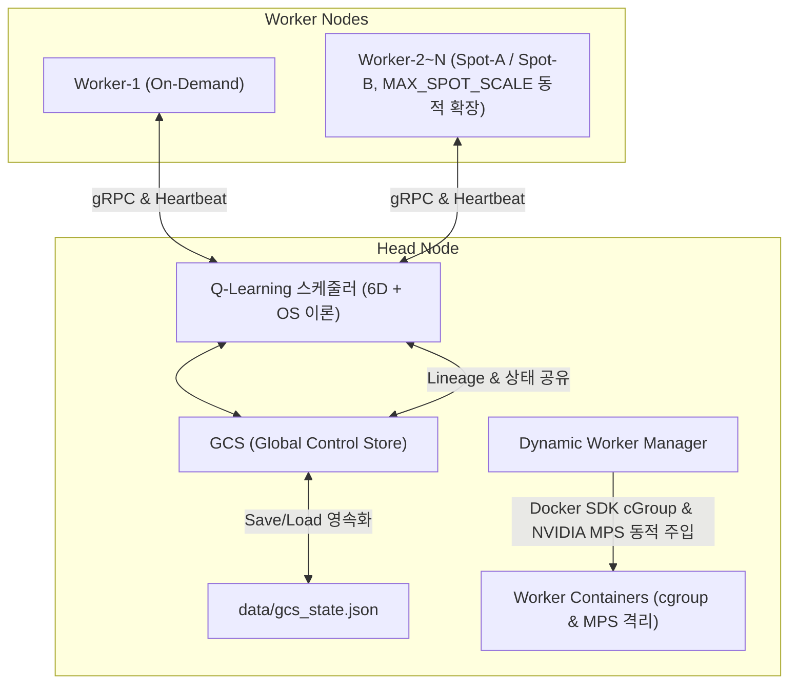

# Baby Ray 프로젝트 수행계획서 및 기술제안서 (통합 개편본)

본 문서는 이기종 가상 클러스터 기반 ML 분산 학습 제어 엔진인 **WE-MEET**의 프로젝트 수행 계획과 기술 설계 명세서입니다. 탄력적인 가상 클라우드 인프라의 요금제 및 이질성을 활용하여, OOM 병목을 회피하고 가용 비용 대비 분산 학습 Throughput을 자동 극대화하는 탄력적 지능형 제어 엔진을 목표로 정립하였습니다. 기존 수행 계획 및 구현 리스트와 일정을 보존한 상태에서, OS 스케줄링 기법 및 6차원 상태 공간 Q-Learning 설계를 보완하여 재정립하였습니다.

> 📌 **정합화 기준(2026-07-09)**: 본 [Part 2] 기술제안서의 수치·규격은 07-09 패치가 반영된 **실제 소스 코드를 기준(source of truth)**으로 재검증·갱신되었습니다. 

---

# [Part 1] 프로젝트 수행계획서

## 1. 과제 개요 및 주요 목표
*   단일 Windows 호스트 PC 환경(WSL2 기반 Docker) 하에서 gRPC, 리눅스 cGroup 자원 격리, 그리고 강화학습(Q-Learning) 및 OS 스케줄링 이론을 융합하여 탄력적인 가상 클라우드 인프라의 요금제 및 이질성을 활용하고, OOM 병목을 회피하여 가용 비용 대비 분산 학습 Throughput을 자동 극대화하는 탄력적 지능형 제어 엔진을 구현합니다.
*   학습 모델(CNN, RNN, LSTM)의 고유한 자원 요구도 특성에 대응하여 물리적인 자원 격리를 시연하고 최적의 가변 요금제(Spot 요금제) 스케줄링 정책을 학습해 냄으로써 실제 분산 컴퓨팅 런타임의 최적 자원 배분 메커니즘을 증명하는 것을 최종 목표로 합니다.

## 2. 주요 추진 목표 및 핵심 구현 리스트
*   **이기종 가상 성능 시뮬레이션**: 단일 호스트(RTX 4060 Laptop) 내에서 인위적인 소프트웨어 `sleep` 지연 대신, 호스트의 **NVIDIA MPS(Multi-Process Service) 물리 CUDA 스레드 할당 격리**(`CUDA_MPS_ACTIVE_THREAD_PERCENTAGE` = `gpu_scale_factor * 100`) 환경변수를 활용하여 노드별 물리 성능 편차 구현. (상세 내역은 [Part 2] §7 참조)
    *   **Worker-1**: On-Demand (Scale 1.0, CPU 2.0 Cores, Mem 2GB, 상시 고정 노드)
    *   **Worker-2~N**: Spot-A (Scale 0.6, CPU 1.0 Core, Mem 1GB) 및 Spot-B (Scale 0.3, CPU 0.5 Core, Mem 512MB) — 동적 스케일아웃으로 확장되며 컨테이너 번호(index)를 재사용.
    *   **스팟 확장 상한**: 호스트 물리 RAM 용량을 감지하여 **동적으로 스케일 상한(MAX_SPOT_SCALE)을 조절**(`resource_guard.get_recommended_max_spot_scale()`, 하한값 5)하며, `scheduler_daemon.py`에서 관장. 단, 상한 카운트는 현재 `spot_a` 대수만 집계(`get_current_spot_scale()`)하므로 `spot_a`/`spot_b` 혼합 상황에서는 총 스팟 대수가 상한을 초과할 수 있습니다.
*   **3대 머신러닝 워크로드 구성**:
    *   **이미지 분류 (CNN)**: SimpleCNN (GPU 연산 집약형, Spot 절감 검증용)
    *   **시계열 예측 (RNN)**: SimpleRNN (CPU/GPU 균형 연산형, 노드 이종성 검증용)
    *   **자연어 처리 (LSTM)**: SimpleLSTM (메모리 집약형, cGroup 제한 측정용)
*   **Task Lineage DAG 기반 장애 자가 복구**:
    *   Heartbeat 3.0초 미수신 시 DEAD 판정 ➔ GCS의 Task Lineage DAG 분석 ➔ 의존 하위 태스크 식별 ➔ 최신 체크포인트부터 학습 재개 및 Auto Scale-out 연동. (하트비트 송신 주기 5.0초와 판정 임계치 3.0초의 동작 현황 그대로 유지하여 스팟 Eviction에 기민하게 대응)
*   **고가용성 및 클러스터 안전 가드 장치 (Fault-Tolerance & Guard Systems)**:
    *   **비동기 좀비 컨테이너 클리너 (Async GCS Cleaner)**: Head Node 초기 구동 시, 호스트에 잔존하던 과거의 비정상 종료 Spot 컨테이너 잔해를 검출하여 **비동기 데몬 스레드로 백그라운드 소거**. gRPC 소켓 바인딩 및 서비스 시작을 차단하던 구버전 삭제 딜레이(3초 블로킹 병목)를 해결.
    *   **호스트 물리 메모리 Guard (Host Memory Guard)**: 스케일아웃 기동 시 `psutil.virtual_memory().percent`로 호스트 물리 메모리 사용률을 측정하여 **사용률이 85.0%를 초과**하면 추가 컨테이너 배포를 거부·보류하여 호스트 OS의 OOM 붕괴를 방지합니다. WSL2 환경에서는 컨테이너 내부 `free -b` 측정치와 비교하여 더 큰 사용률을 채택(보수적 판정)합니다. 환경변수 `BYPASS_RESOURCE_GUARD=1` 설정 시 이 가드를 단락(short-circuit) 우회합니다. (`head/cluster_manager.py:is_host_resource_sufficient`)
    *   **가용 GPU VRAM Guard (VRAM Guard)**: `nvidia-smi --query-gpu=memory.free`로 가용 GPU 메모리를 조회하여 **500 MiB 미만**일 때 스케일아웃을 긴급 차단하여 VRAM 고갈에 따른 CUDA 연산 크래시를 차단합니다.
    *   **작업 분배 롤백 방어 (Task Rollback Guard)**: 다중 배정(Multi-Dispatch) 과정에서 경합 조건 등으로 인해 특정 워커로의 태스크 바인딩 및 연산 위임에 실패할 경우, 작업을 삭제하지 않고 GCS 대기열의 맨 앞(`insert(0, task)`)으로 즉각 안전하게 회수 및 롤백.

## 3. 주차별 추진 일정 (상세 일정표)

| 주차/일차 | 팀 목표 및 활동 | 성시준 (팀장) 역할 | 김현진 (팀원) 역할 | 투입시간 |
| :--- | :--- | :--- | :--- | :--- |
| **0주차** | 가상 자원 분산 환경 가설 검토 및 계획서 구체화 | gRPC 프로토콜 분석, 뼈대 설계 | 운영 자동화 및 도입 타당성 검토 | 4 |
| **1일차 (6.22)** | 프로젝트 주제 구체화 및 방향성 탐색 | 팀 빌딩 및 분산 컴퓨팅 연구 방향 정의 | 로컬 가상화 도입 타당성 검토 | 6 |
| **2일차 (6.23)** | 가상 분산 런타임 통신 구조 선행 분석 | gRPC 및 생존 확인 통신 구조 기획 | 인프라 배포 자동화 스크립트 설계 | 8 |
| **3일차 (6.24)** | 통신 인터페이스 메시지 규격 설계 | Protobuf 기반 데이터 송수신 규격 설계 | 가상 인프라 모니터링 변수 정의 | 8 |
| **4일차 (6.25)** | 가상 인프라 자원 연동 구조 설계 | Docker cGroup 자원 제한 메커니즘 설계 | 단독 노드 기반 AI 연산 파이프라인 개발 | 8 |
| **5일차 (6.26)** | 0주차 마일스톤 점검 및 저장소 초기화 | 수행계획서 취합 및 GitHub 저장소 설정 | 학습 데이터셋 합성 및 전처리 완료 | 8 |
| **6일차 (6.29)** | 강화학습 의사결정 액션 최적화 및 감쇄 도입 | Action Space 4개 축소 및 Epsilon Decay 설계 구현 | 에이전트 모듈 리팩토링 및 캘리브레이션 | 8 |
| **7일차 (6.30)** | 코드 표준화 및 다큐멘테이션 보강 | 기존 주석 완벽 보존하며 표준 Docstring 추가 | PDF 명세서 추출용 포맷 정돈 | 8 |
| **8일차 (7.01)** | 의존성 기반 Task Lineage DAG 개발 | Lineage 의존성 탐색 및 Cascaded Recovery 구현 | 장애 상황별 복구 시나리오 테스트 보조 | 8 |
| **9일차 (7.02)** | 오프라인 가상 시뮬레이션 기반 고속 학습 | 사전 학습 시뮬레이터 작성 및 Q-Table 최적 수렴 | 에피소드 반복 횟수별 학습 데이터 추출 | 10 |
| **10일차 (7.03)** | 실환경 컨테이너 연동 및 검증 | GCS 연동 미세 조정 및 가상 OOM 안정성 검증 | 실환경 벤치마크 학습 로그 분석 | 6 |
| **11일차 (7.06)** | 연산 부하 평준화 및 자원 균일화 모델 보강 | 3대 ML 워크로드 파라미터 튜닝 및 OOM 방어 적용 | 모의 부하에 따른 cGroup 자원 분석 | 8 |
| **12일차 (7.07)** | 시뮬레이터 속도 지연 캘리브레이션 | 이기종 노드별 수행 시간 및 비용 추이 매핑 | 벤치마크 테스트 데이터 로깅 자동화 | 8 |
| **13일차 (7.08)** | 스케줄러 알고리즘 비교 실험 (RL vs HEUR) | Q-Learning vs FIFO/Random 비교 실험 수행 | 알고리즘별 SLA 준수율 및 비용 통계 정리 | 8 |
| **14일차 (7.09)** | 분산 클러스터 탄력성 벤치마크 수행 | Spot 워커 다수(최대 7대) 증설 환경 가상 확장 및 부하 테스트 | 오토스케일링 딜레이에 따른 병목 수치화 | 7 |
| **15일차 (7.10)** | 통합 자원 가드 보호 기전 극한 검증 | Host/GPU 메모리 경계 조건 강제 진입 및 차단 검증 | OOM Preemption Guard 무결성 평가 | 8 |
| **16일차 (7.13)** | 벤치마크 데이터 시각화 | Throughput 및 비용 소모 추이 시각화 그래프 구현 | 최종 분석용 벤치마크 이미지 패키징 | 8 |
| **17일차 (7.14)** | 시스템 개선 및 멘토링 피드백 반영 | 의사결정 수렴 상태 최종 점검 및 미세 튜닝 | 시각화 보고서 오류 보정 및 수정 | 8 |
| **18일차 (7.15)** | 최종 시스템 배포 빌드 정돈 | Docker Compose 및 SDK 통합 구동 스크립트 작성 | 최종 런타임 안정성 총괄 점검 | 8 |
| **19일차 (7.16)** | 최종 결과 보고서 종합 작성 | 기술 산출물 문서 패키징 및 보고서 검토 | 결과보고서 본문 기술 문서 종합 작성 | 8 |
| **20일차 (7.17)** | 프로젝트 최종 제출 및 마감 | 최종 보고서 검토 및 최종 검수 | 최종 과제물 및 산출물 업로드 완료 | 4 |

---

# [Part 2] 기술제안서 (Technical Proposal)

## 1. 분산 아키텍처 및 제어 토폴로지

본 프로젝트는 **1 Head Node - $N$ Worker Nodes** 구조의 분산 런타임을 구축합니다.
GCS(Global Control Store)는 분산 컴퓨팅의 모든 메타데이터(노드 상태, 작업 대기열, Task Lineage, 체크포인트 경로)를 유지하는 중앙 동기화 계층으로 동작하며, Head Node 내에 인메모리 스토어로 내장됩니다.

---

## 2. gRPC 기반 고성능 통신 인터페이스 및 프로토콜 규격

### 가. 프로토콜 타임아웃 및 메트릭 전송 수치 정의
1.  **Heartbeat 전송 주기**: 모든 활성 Worker는 **5.0초** 간격(`common/config.py:DEFAULT_HEARTBEAT_INTERVAL = 5.0`)으로 Head Node에 자신의 CPU/Memory 자원 사용률을 포함한 상태 패킷을 송신합니다.
2.  **생존 유실 판정 임계치 (Heartbeat Timeout)**: Head Node가 특정 Worker로부터 **3.0초** 동안 Heartbeat를 수신하지 못하면, 해당 노드를 `DEAD` 상태로 간주하고 장애 복구 프로토콜을 수행합니다(`head/scheduler/scheduler_daemon.py:check_and_cleanup_dead_workers`). 단, `worker-1`(`on_demand`) 고정 노드는 DEAD 판정 대상에서 영구 제외합니다.
    *   ⚠️ **설계상 유의점 (코드 기준)**: 송신 주기(5.0초)가 판정 임계치(3.0초)보다 길어, 실제 생존한 스팟 노드도 순간적으로 DEAD로 오탐될 여지가 있습니다. 이는 스팟 Eviction을 3초 이내로 대단히 기민하게 감지하고 장애 자가 복구를 즉시 구동하기 위해 의도된 트레이드오프 설계 방식입니다.
3.  **태스크 할당 및 수거 지연**: gRPC 호출(`AssignTask`/`GetTaskStatus`)에는 **명시적 deadline을 설정하지 않으며**, 대신 스케줄러의 **0.2초 고속 의사결정 루프(High-Frequency Scheduling)**와 매 틱(5틱마다 1회인 1초 주기)마다 GCS 워커 레지스트리 생존 재확인으로 유실을 감지합니다. 워커가 레지스## 5. 6차원 상태 공간(State Space) 및 OS 스케줄링 이론 접목

Q-Learning 에이전트의 상태 변별력을 극대화하여 실제 시스템상의 병목 현상을 방지하도록 수학 모델을 6차원으로 고도화합니다. 모든 스케줄링 상태는 [state_features.py](file:///c:/Users/win/Desktop/클라우드  WE-MEET 프로젝트/WE-MEET/head/q_learning/state_features.py)에서 유일하고 동기화된 방식으로 산출됩니다.

### 가. 6차원 상태 공간 공식 정의

에이전트가 참조하는 상태는 아래 6개 이산 축의 튜플입니다.

$$State = (q\_bucket,\; head\_model,\; a\_mix,\; sla\_bucket,\; danger\_phase,\; budget\_level)$$

1.  **`q_bucket` (대기열 적체 깊이)** ∈ `{0, 1, 2, 3}`: 큐의 태스크 적체량에 따른 버킷 분류.
    *   `0`: 빈 큐 (적체량 0)
    *   `1`: 경적체 (적체량 1 ~ 3)
    *   `2`: 중적체 (적체량 4 ~ 7)
    *   `3`: 과적체 (적체량 8 이상) ➔ 대기열 캐스케이드(Cascade) 폭발 방지 지표
2.  **`head_model` (선두 실행가능 태스크 성격)** ∈ `{0, 1}`: GCS 큐 최선두에 대기 중인(의존성이 충족된) 태스크의 성격 분류.
    *   `0`: 연산 집약형 (CNN, MERGE 또는 태스크 없음)
    *   `1`: 메모리 집약형 (RNN, LSTM) ➔ 노드별 용량 초과 OOM 회피 라우팅용
3.  **`a_mix` (유휴 노드 활성 비트맵)** ∈ `{0 … 7}`: 현재 IDLE 상태로 배정이 가용한 노드 풀의 조합을 3비트로 인코딩.
    *   $$a\_mix = (\text{on\_demand idle}) \cdot 1 + (\text{spot\_a idle}) \cdot 2 + (\text{spot\_b idle}) \cdot 4$$
4.  **`sla_bucket` (SLA 마감 완급)** ∈ `{0, 1, 2}`: 선두 태스크의 마감 기한까지 남은 시간(`time_left = deadline - now`) 기준 버킷.
    *   `0`: 여유 (30.0초 초과)
    *   `1`: 중간 (10.0초 초과 ~ 30.0초 이하)
    *   `2`: 임박 (10.0초 이하)
5.  **`danger_phase` (스팟 회수 위험구간 여부)** ∈ `{0, 1}`: 30초의 회수 위험 주기 중 현재가 강제 선점 위험구간에 진입해 있는가에 대한 플래그.
    *   `0`: 안전 구간 (30초 중 뒤 20초)
    *   `1`: 위험 구간 (30초 중 앞 10초) ➔ 스팟 회수 룰렛 타이밍 회피 지표
6.  **`budget_level` (잔여 가상 예산 수준)** ∈ `{0, 1, 2}`: 가상 예산의 잔여 수준에 따른 레벨화.
    *   `0`: 예산 위험 ($0.7 미만)
    *   `1`: 예산 낮음 ($3.0 미만)
    *   `2`: 예산 여유 ($3.0 이상)

### 가-2. 행동 공간(Action Space) 정의 및 행동 마스킹 (Action Masking)

Q-Learning 에이전트는 다음 6개 행동 중 하나를 선택합니다(`head/q_learning/agent.py:self.actions = [0..5]`).

| Action | 의미 | 비고 |
| :--- | :--- | :--- |
| `0` | ASSIGN_ON_DEMAND | On-Demand 노드에 배정 |
| `1` | ASSIGN_SPOT_A | Spot-A 노드에 배정 |
| `2` | ASSIGN_SPOT_B | Spot-B 노드에 배정 |
| `3` | HOLD | 배정 보류(대기) |
| `4` | SCALE_OUT_SPOT_A | Spot-A 스케일아웃 (큐 $\ge 6$이면 2대) |
| `5` | SCALE_OUT_SPOT_B | Spot-B 스케일아웃 (큐 $\ge 6$이면 2대) |

#### 🛡️ 행동 마스킹 안전 가드 정책 (Action Masking)
실제 구동 환경에서 치명적인 크래시나 자원 고갈을 방지하기 위해 가용한 행동 공간을 동적으로 한정(마스킹)합니다:
*   **예산 고갈 마스킹**: 가상 예산이 고갈($\le 0.0$)되었을 경우, 고비용 작업인 On-Demand 배정(Action `0`) 및 Spot-A/B 스케일아웃(Action `4`, `5`)을 선택할 수 없도록 강제 차단합니다.
*   **물리 자원 부족 마스킹**: 호스트 물리 메모리 가드([cluster_manager.py](file:///c:/Users/win/Desktop/클라우드  WE-MEET 프로젝트/WE-MEET/head/cluster_manager.py))에 의해 물리 리소스가 부족(메모리 사용률 85% 초과 등)하다고 감지되면 Spot 스케일아웃(Action `4`, `5`)을 마스킹하여 호스트 붕괴를 방지합니다.
*   **마감 임박 HOLD 억제 마스킹**: 선두 태스크의 마감이 10초 이하(`sla_bucket = 2`)로 임박하고 배정 가능한 유휴 노드가 1대라도 있을 경우, HOLD(Action `3`)를 행동 풀에서 지워 Starvation을 원천 차단하고 즉시 배정을 유도합니다.
*   **Cold Start 지연 마스킹**: 컨테이너가 생성(LAUNCHING)되었으나 아직 Head GCS 레지스트리에 등록되지 않은 스팟 노드가 존재할 경우 추가적인 동적 증설(Action `4`, `5`)을 일시 제한하여 중복 오버헤드를 막습니다.

### 나. 운영체제(OS) 스케줄링 기법의 결합 및 극복

#### 1) Backfilling (비순차 스케줄링) 을 통한 HOL Blocking 극복
*   **문제**: 큐 선두의 LSTM 작업이 가용 On-Demand 자원이 없어 대기할 때, 후순위의 CNN 작업이 비어 있는 Spot-A 노드를 활용하지 못하고 대기열에서 노는 병목 발생.
*   **해법**: 스케줄러 루프 내에 **Backfilling 알고리즘**을 결합합니다. 최선두 태스크 배정이 보류될 경우, 큐 내부를 후방 탐색하여 현재 비어 있는 Spot-A 노드 스펙에 딱 맞는 CNN 작업을 선제 배정하여 클러스터 가동률을 극대화합니다.

#### 2) SLA 마감 패널티를 통한 Starvation 극복 및 지연 보상 (Delayed Reward)
*   **문제**: 강화학습 에이전트가 예산 보존(Reward 상승)을 위해 무겁고 요금이 비싼 RNN/LSTM 작업을 무한정 보류(Action `3`: HOLD)시키는 기아(Starvation) 현상이 발생할 수 있습니다.
*   **해법 (실제 구현, `head/q_learning/agent.py:calculate_reward`)**: 배정 시점에 성급한 낙관적 보상을 주는 방식 대신, 실제 태스크가 완료되거나 회수/OOM으로 실패하는 시점에 해당 배정의 상태-행동 쌍에 보상을 소급 귀속하는 **지연 보상(Delayed Reward Credit Assignment) 경로**를 활성화합니다.
    $$Reward = R_{success} - C_{cost} - P_{makespan} - P_{delay} - P_{evicted} + R_{co\text{-}sched}$$

    | 항 | 가중치 상수 | 설명 |
    | :--- | :--- | :--- |
    | $R_{success}$ | `SUCCESS_REWARD = 20.0` | 태스크 성공 완료 시 부여 |
    | $C_{cost}$ | `COST_WEIGHT = 1000.0` | 시간 환산 요금 체감 감점을 위해 $1000.0 \times (cost \times time / 3600)$ 차감 |
    | $P_{makespan}$ | `MAKESPAN_WEIGHT = 0.5` | 마감 초과 여부와 무관하게 '느림' 자체에 대가 부과 ($0.5 \times execution\_time$) |
    | $P_{delay}$ | `DELAY_PENALTY_WEIGHT = 5.0` | 마감 기한 초과분에 대해 **초당 −5.0**의 지연 페널티 부과 |
    | $P_{evicted}$ | `EVICTION_PENALTY = 25.0` | 스팟 노드가 강제 회수(Eviction)되어 실패한 경우 부과되는 벌점 |
    | $R_{co\text{-}sched}$ | 융합(상보 자원) 시 **+0.15** / 경합(동일 자원) 시 **−0.20** | 이종 모형 동거 시의 조화도 추가/감점 |

*   **Starvation 방어**: 마감을 초과하면 $P_{delay}$(초당 −5.0)가 기하급수적으로 누적되어 무한 보류 행동을 강력하게 억제합니다. 또한 GCS에서 대체 자원으로 재큐잉되는 서브태스크에는 `deadline = now + 20.0초`가 재부여되어 빠른 수렴을 유도합니다.

#### 3) 학습 하이퍼파라미터 및 수렴 정책
*   학습률 $\alpha = 0.1$, 할인율 $\gamma = 0.9$, 탐험률 $\epsilon$: 초기 `1.0` → 최소 `0.05`, 감쇠율 `decay_rate = 0.995`.
*   ⚠️ **유의점**: 저장된 Q-Table(비어있지 않음)을 로드하면 $\epsilon$이 즉시 최소값(0.05)으로 강제 설정되어, 사전 학습 이후 실환경 구동은 사실상 **탐욕적(greedy)** 정책에 가깝게 동작합니다.el.yaml`)

| 노드 타입 | `cpu_limit` | `memory_limit_mb` | `cost_per_hour` | `gpu_scale_factor` | `preemption_probability` |
| :--- | :--- | :--- | :--- | :--- | :--- |
| **On-Demand** (기본 코어 노드) | 2.0 | 2048 | **$7.10/hr** | 1.0 | 0.0 |
| **Spot-A** (성능 지향 가속 노드) | 1.0 | 1024 | **$2.20/hr** | 0.6 | 0.30 |
| **Spot-B** (안정 지향 경량 노드) | 0.5 | 512 | **$0.90/hr** | 0.3 | 0.10 |

*   On-Demand는 가장 안정적이며 preemption이 없고, Spot-A는 60% GPU 성능 격리를 지원하는 중간 요금의 휘발성 노드이며, Spot-B는 가장 저렴하고 회수율(0.10)이 매우 낮아 안정적인 극가성비 최경량 노드입니다.
*   초기 가상 예산은 **$1.5**(`head/state.py:INITIAL_VIRTUAL_BUDGET`)로 설정되어 있습니다. (실제 벤치마크 시나리오 상에서 비용 축의 예산 고갈을 체감할 수 있도록 현실화된 단가)
*   **cGroup & MPS 동적 로드**: 컨테이너 실제 기동 시 `cluster_manager.py`의 `scale_out_worker()`는 하드코딩 대신 `_load_node_config()` 헬퍼를 통해 `common/cost_model.yaml` 명세를 **동적으로 로드**하여 `nano_cpus` 및 `mem_limit`, 그리고 NVIDIA MPS 스레드 제한(`CUDA_MPS_ACTIVE_THREAD_PERCENTAGE` = `gpu_scale_factor * 100`)을 컨테이너 생성 시 동적 주입합니다.

### 나. WSL2 / Docker RAM 안전 모니터링 가드
Windows 호스트 시스템에서 WSL2가 램을 임의 점유하여 전체 OOM을 유발하는 문제를 막기 위해, 클러스터 매니저는 스케일 아웃 지시 전 호스트 메모리 사용률을 측정합니다.
*   1차로 `psutil.virtual_memory().percent`(호스트 물리 메모리 사용률)를 측정하고, WSL2 환경에서는 컨테이너 내부 `free -b` 결과에서 산출한 사용률과 비교하여 **더 큰(더 보수적인) 값**을 채택합니다.
*   채택 사용률이 **85.0%를 초과**할 경우, 추가적인 Spot 노드의 스케일 아웃을 선제적으로 거부하여 호스트의 안전을 가드합니다.
*   개발/디버깅 목적으로 `BYPASS_RESOURCE_GUARD=1` 환경변수를 부여하면 이 가드를 단락 우회할 수 있습니다.

---

## 4. 3대 스케줄러 메커니즘 특성 비교

| 비교 항목 | Static 스케줄러 모드 | Dynamic 스케줄러 모드 | Q-Learning (6D + OS 이론) 스케줄러 모드 |
| :--- | :--- | :--- | :--- |
| **의사결정 방식** | 큐 대기 크기 기준 정적 임계치 룰 | 노드 평균 자원(CPU/MEM) 부하 임계치 룰 | 6차원 상태 인지 및 행동 정책 기계 학습 |
| **스케일 아웃 조건** | 큐 길이 $\ge 2$ → Spot-A 1대, $\ge 6$ → 2대 | (평균 CPU/MEM $\gt 70\%$) 또는 큐 $\ge 3$ → 1대, 큐 $\ge 8$ → 2대 | Action 4/5 선택 시 기동(큐 $\ge 6$이면 2대). 예산·요금·위험구간 등에 따라 학습된 정책으로 결정 |
| **스케일 인 조건** | 큐가 비고 유휴 타이머 $\ge 3.0$초 유지 | 큐가 비고 평균 CPU/MEM $\lt 20\%$ 가 $3.0$초 유지 | 유휴(IDLE) 스팟 노드가 감지된 상태가 $3.0$초 지속(Spot-A 우선 회수) |
| **자원 효율성** | 낮음 (큐 크기만 보고 확장하므로 자원 낭비) | 보통 (실시간 자원 부하를 추적하여 분산함) | **높음** (모형의 성격에 맞춰 하드웨어 친화적 격리 배정) |
| **Starvation 해결** | 없음 (FIFO 순차 처리로 인한 지연) | 없음 | **있음 (SLA 지연 페널티 적용)**: 마감 초과 시 초당 −5.0 누적 감점 |
| **선두 차단(HOL) 해결**| 없음 | 없음 | **있음 (OS Backfilling 결합)**: 후순위 태스크 우회 배정 |
| **한계 및 단점** | 워크로드 폭증 시 유연한 대처 불가 | 일시적인 부하 요동에 따른 노드 플래핑(Flapping) | 학습 수렴 전까지 탐험(Exploration) 오버헤드 존재 |

> **현재 기본 구동 모드**: `head/state.py:SCHEDULER_MODE = "dynamic"`. 즉 런타임 기본값은 Dynamic 스케줄러이며, Q-Learning 모드는 사전 학습(`head/q_learning/pretrain.py`)으로 수렴시킨 Q-Table을 로드하여 선택적으로 구동합니다. 세 모드 모두 공통 자원 가드(§3)와 Backfilling/장애 복구(§6)를 공유합니다.

---

## 5. 6차원 상태 공간(State Space) 및 OS 스케줄링 이론 접목

Q-Learning 에이전트의 상태 변별력을 극대화하여 실제 시스템상의 병목 현상을 방지하도록 수학 모델을 6차원으로 고도화합니다. 모든 스케줄링 상태는 [state_features.py](file:///c:/Users/win/Desktop/클라우드  WE-MEET 프로젝트/WE-MEET/head/q_learning/state_features.py)에서 유일하고 동기화된 방식으로 산출됩니다.

### 가. 6차원 상태 공간 공식 정의

에이전트가 참조하는 상태는 아래 6개 이산 축의 튜플입니다.

$$State = (q\_bucket,\; head\_model,\; a\_mix,\; sla\_bucket,\; danger\_phase,\; budget\_level)$$

1.  **`q_bucket` (대기열 적체 깊이)** ∈ `{0, 1, 2, 3}`: 큐의 태스크 적체량에 따른 버킷 분류.
    *   `0`: 빈 큐 (적체량 0)
    *   `1`: 경적체 (적체량 1 ~ 3)
    *   `2`: 중적체 (적체량 4 ~ 7)
    *   `3`: 과적체 (적체량 8 이상) ➔ 대기열 캐스케이드(Cascade) 폭발 방지 지표
2.  **`head_model` (선두 실행가능 태스크 성격)** ∈ `{0, 1}`: GCS 큐 최선두에 대기 중인(의존성이 충족된) 태스크의 성격 분류.
    *   `0`: 연산 집약형 (CNN, MERGE 또는 태스크 없음)
    *   `1`: 메모리 집약형 (RNN, LSTM) ➔ 노드별 용량 초과 OOM 회피 라우팅용
3.  **`a_mix` (유휴 노드 활성 비트맵)** ∈ `{0 … 7}`: 현재 IDLE 상태로 배정이 가용한 노드 풀의 조합을 3비트로 인코딩.
    *   $$a\_mix = (\text{on\_demand idle}) \cdot 1 + (\text{spot\_a idle}) \cdot 2 + (\text{spot\_b idle}) \cdot 4$$
4.  **`sla_bucket` (SLA 마감 완급)** ∈ `{0, 1, 2}`: 선두 태스크의 마감 기한까지 남은 시간(`time_left = deadline - now`) 기준 버킷.
    *   `0`: 여유 (30.0초 초과)
    *   `1`: 중간 (10.0초 초과 ~ 30.0초 이하)
    *   `2`: 임박 (10.0초 이하)
5.  **`danger_phase` (스팟 회수 위험구간 여부)** ∈ `{0, 1}`: 30초의 회수 위험 주기 중 현재가 강제 선점 위험구간에 진입해 있는가에 대한 플래그.
    *   `0`: 안전 구간 (30초 중 뒤 20초)
    *   `1`: 위험 구간 (30초 중 앞 10초) ➔ 스팟 회수 룰렛 타이밍 회피 지표
6.  **`budget_level` (잔여 가상 예산 수준)** ∈ `{0, 1, 2}`: 가상 예산의 잔여 수준에 따른 레벨화.
    *   `0`: 예산 위험 ($0.7 미만)
    *   `1`: 예산 낮음 ($3.0 미만)
    *   `2`: 예산 여유 ($3.0 이상)

### 가-2. 행동 공간(Action Space) 정의 및 행동 마스킹 (Action Masking)

Q-Learning 에이전트는 다음 6개 행동 중 하나를 선택합니다(`head/q_learning/agent.py:self.actions = [0..5]`).

| Action | 의미 | 비고 |
| :--- | :--- | :--- |
| `0` | ASSIGN_ON_DEMAND | On-Demand 노드에 배정 |
| `1` | ASSIGN_SPOT_A | Spot-A 노드에 배정 |
| `2` | ASSIGN_SPOT_B | Spot-B 노드에 배정 |
| `3` | HOLD | 배정 보류(대기) |
| `4` | SCALE_OUT_SPOT_A | Spot-A 스케일아웃 (큐 $\ge 6$이면 2대) |
| `5` | SCALE_OUT_SPOT_B | Spot-B 스케일아웃 (큐 $\ge 6$이면 2대) |

#### 🛡️ 행동 마스킹 안전 가드 정책 (Action Masking)
실제 구동 환경에서 치명적인 크래시나 자원 고갈을 방지하기 위해 가용한 행동 공간을 동적으로 한정(마스킹)합니다:
*   **예산 고갈 마스킹**: 가상 예산이 고갈($\le 0.0$)되었을 경우, 고비용 작업인 On-Demand 배정(Action `0`) 및 Spot-A/B 스케일아웃(Action `4`, `5`)을 선택할 수 없도록 강제 차단합니다.
*   **물리 자원 부족 마스킹**: 호스트 물리 메모리 가드([cluster_manager.py](file:///c:/Users/win/Desktop/클라우드  WE-MEET 프로젝트/WE-MEET/head/cluster_manager.py))에 의해 물리 리소스가 부족(메모리 사용률 85% 초과 등)하다고 감지되면 Spot 스케일아웃(Action `4`, `5`)을 마스킹하여 호스트 붕괴를 방지합니다.
*   **마감 임박 HOLD 억제 마스킹**: 선두 태스크의 마감이 10초 이하(`sla_bucket = 2`)로 임박하고 배정 가능한 유휴 노드가 1대라도 있을 경우, HOLD(Action `3`)를 행동 풀에서 지워 Starvation을 원천 차단하고 즉시 배정을 유도합니다.
*   **Cold Start 지연 마스킹**: 컨테이너가 생성(LAUNCHING)되었으나 아직 Head GCS 레지스트리에 등록되지 않은 스팟 노드가 존재할 경우 추가적인 동적 증설(Action `4`, `5`)을 일시 제한하여 중복 오버헤드를 막습니다.

### 나. 운영체제(OS) 스케줄링 기법의 결합 및 극복

#### 1) Backfilling (비순차 스케줄링) 을 통한 HOL Blocking 극복
*   **문제**: 큐 선두의 LSTM 작업이 가용 On-Demand 자원이 없어 대기할 때, 후순위의 CNN 작업이 비어 있는 Spot-A 노드를 활용하지 못하고 대기열에서 노는 병목 발생.
*   **해법**: 스케줄러 루프 내에 **Backfilling 알고리즘**을 결합합니다. 최선두 태스크 배정이 보류될 경우, 큐 내부를 후방 탐색하여 현재 비어 있는 Spot-A 노드 스펙에 딱 맞는 CNN 작업을 선제 배정하여 클러스터 가동률을 극대화합니다.

#### 2) SLA 마감 패널티를 통한 Starvation 극복 및 지연 보상 (Delayed Reward)
*   **문제**: 강화학습 에이전트가 예산 보존(Reward 상승)을 위해 무겁고 요금이 비싼 RNN/LSTM 작업을 무한정 보류(Action `3`: HOLD)시키는 기아(Starvation) 현상이 발생할 수 있습니다.
*   **해법 (실제 구현, `head/q_learning/agent.py:calculate_reward`)**: 배정 시점에 성급한 낙관적 보상을 주는 방식 대신, 실제 태스크가 완료되거나 회수/OOM으로 실패하는 시점에 해당 배정의 상태-행동 쌍에 보상을 소급 귀속하는 **지연 보상(Delayed Reward Credit Assignment) 경로**를 활성화합니다.
    $$Reward = R_{success} - C_{cost} - P_{makespan} - P_{delay} - P_{evicted} + R_{co\text{-}sched}$$

    | 항 | 가중치 상수 | 설명 |
    | :--- | :--- | :--- |
    | $R_{success}$ | `SUCCESS_REWARD = 20.0` | 태스크 성공 완료 시 부여 |
    | $C_{cost}$ | `COST_WEIGHT = 1000.0` | 시간 환산 요금 체감 감점을 위해 $1000.0 \times (cost \times time / 3600)$ 차감 |
    | $P_{makespan}$ | `MAKESPAN_WEIGHT = 0.5` | 마감 초과 여부와 무관하게 '느림' 자체에 대가 부과 ($0.5 \times execution\_time$) |
    | $P_{delay}$ | `DELAY_PENALTY_WEIGHT = 5.0` | 마감 기한 초과분에 대해 **초당 −5.0**의 지연 페널티 부과 |
    | $P_{evicted}$ | `EVICTION_PENALTY = 25.0` | 스팟 노드가 강제 회수(Eviction)되어 실패한 경우 부과되는 벌점 |
    | $R_{co\text{-}sched}$ | 융합(상보 자원) 시 **+0.15** / 경합(동일 자원) 시 **−0.20** | 이종 모형 동거 시의 조화도 추가/감점 |

*   **Starvation 방어**: 마감을 초과하면 $P_{delay}$(초당 −5.0)가 기하급수적으로 누적되어 무한 보류 행동을 강력하게 억제합니다. 또한 GCS에서 대체 자원으로 재큐잉되는 서브태스크에는 `deadline = now + 20.0초`가 재부여되어 빠른 수렴을 유도합니다.

#### 3) 학습 하이퍼파라미터 및 수렴 정책
*   학습률 $lpha = 0.1$, 할인율 $\gamma = 0.9$, 탐험률 $\epsilon$: 초기 `1.0` → 최소 `0.05`, 감쇠율 `decay_rate = 0.995`.
*   ⚠️ **유의점**: 저장된 Q-Table(비어있지 않음)을 로드하면 $\epsilon$이 즉시 최소값(0.05)으로 강제 설정되어, 사전 학습 이후 실환경 구동은 사실상 **탐욕적(greedy)** 정책에 가깝게 동작합니다.el.yaml`)

| 노드 타입 | `cpu_limit` | `memory_limit_mb` | `cost_per_hour` | `gpu_scale_factor` | `preemption_probability` |
| :--- | :--- | :--- | :--- | :--- | :--- |
| **On-Demand** (기본 코어 노드) | 2.0 | 2048 | **$7.10/hr** | 1.0 | 0.0 |
| **Spot-A** (성능 지향 가속 노드) | 1.0 | 1024 | **$2.20/hr** | 0.6 | 0.30 |
| **Spot-B** (안정 지향 경량 노드) | 0.5 | 512 | **$0.90/hr** | 0.3 | 0.10 |

*   On-Demand는 가장 안정적이며 preemption이 없고, Spot-A는 60% GPU 성능 격리를 지원하는 중간 요금의 휘발성 노드이며, Spot-B는 가장 저렴하고 회수율(0.10)이 매우 낮아 안정적인 극가성비 최경량 노드입니다.
*   초기 가상 예산은 **$1.5**(`head/state.py:INITIAL_VIRTUAL_BUDGET`)로 설정되어 있습니다. (실제 벤치마크 시나리오 상에서 비용 축의 예산 고갈을 체감할 수 있도록 현실화된 단가)
*   **cGroup & MPS 동적 로드**: 컨테이너 실제 기동 시 `cluster_manager.py`의 `scale_out_worker()`는 하드코딩 대신 `_load_node_config()` 헬퍼를 통해 `common/cost_model.yaml` 명세를 **동적으로 로드**하여 `nano_cpus` 및 `mem_limit`, 그리고 NVIDIA MPS 스레드 제한(`CUDA_MPS_ACTIVE_THREAD_PERCENTAGE` = `gpu_scale_factor * 100`)을 컨테이너 생성 시 동적 주입합니다.

### 나. WSL2 / Docker RAM 안전 모니터링 가드
Windows 호스트 시스템에서 WSL2가 램을 임의 점유하여 전체 OOM을 유발하는 문제를 막기 위해, 클러스터 매니저는 스케일 아웃 지시 전 호스트 메모리 사용률을 측정합니다.
*   1차로 `psutil.virtual_memory().percent`(호스트 물리 메모리 사용률)를 측정하고, WSL2 환경에서는 컨테이너 내부 `free -b` 결과에서 산출한 사용률과 비교하여 **더 큰(더 보수적인) 값**을 채택합니다.
*   채택 사용률이 **85.0%를 초과**할 경우, 추가적인 Spot 노드의 스케일 아웃을 선제적으로 거부하여 호스트의 안전을 가드합니다.
*   개발/디버깅 목적으로 `BYPASS_RESOURCE_GUARD=1` 환경변수를 부여하면 이 가드를 단락 우회할 수 있습니다.

---

## 4. 3대 스케줄러 메커니즘 특성 비교

| 비교 항목 | Static 스케줄러 모드 | Dynamic 스케줄러 모드 | Q-Learning (6D + OS 이론) 스케줄러 모드 |
| :--- | :--- | :--- | :--- |
| **의사결정 방식** | 큐 대기 크기 기준 정적 임계치 룰 | 노드 평균 자원(CPU/MEM) 부하 임계치 룰 | 6차원 상태 인지 및 행동 정책 기계 학습 |
| **스케일 아웃 조건** | 큐 길이 $\ge 2$ → Spot-A 1대, $\ge 6$ → 2대 | (평균 CPU/MEM $\gt 70\%$) 또는 큐 $\ge 3$ → 1대, 큐 $\ge 8$ → 2대 | Action 4/5 선택 시 기동(큐 $\ge 6$이면 2대). 예산·요금·위험구간 등에 따라 학습된 정책으로 결정 |
| **스케일 인 조건** | 큐가 비고 유휴 타이머 $\ge 3.0$초 유지 | 큐가 비고 평균 CPU/MEM $\lt 20\%$ 가 $3.0$초 유지 | 유휴(IDLE) 스팟 노드가 감지된 상태가 $3.0$초 지속(Spot-A 우선 회수) |
| **자원 효율성** | 낮음 (큐 크기만 보고 확장하므로 자원 낭비) | 보통 (실시간 자원 부하를 추적하여 분산함) | **높음** (모형의 성격에 맞춰 하드웨어 친화적 격리 배정) |
| **Starvation 해결** | 없음 (FIFO 순차 처리로 인한 지연) | 없음 | **있음 (SLA 지연 페널티 적용)**: 마감 초과 시 초당 −5.0 누적 감점 |
| **선두 차단(HOL) 해결**| 없음 | 없음 | **있음 (OS Backfilling 결합)**: 후순위 태스크 우회 배정 |
| **한계 및 단점** | 워크로드 폭증 시 유연한 대처 불가 | 일시적인 부하 요동에 따른 노드 플래핑(Flapping) | 학습 수렴 전까지 탐험(Exploration) 오버헤드 존재 |

> **현재 기본 구동 모드**: `head/state.py:SCHEDULER_MODE = "dynamic"`. 즉 런타임 기본값은 Dynamic 스케줄러이며, Q-Learning 모드는 사전 학습(`head/q_learning/pretrain.py`)으로 수렴시킨 Q-Table을 로드하여 선택적으로 구동합니다. 세 모드 모두 공통 자원 가드(§3)와 Backfilling/장애 복구(§6)를 공유합니다.

---

## 5. 4차원 상태 공간(State Space) 및 OS 스케줄링 이론 접목

Q-Learning 에이전트의 상태 변별력을 극대화하여 실제 시스템상의 병목 현상을 방지하도록 수학 모델을 고도화합니다.

### 가. 4차원 상태 공간 공식 정의

에이전트가 참조하는 상태는 아래 4개 이산 축의 튜플입니다. (`head/q_learning/scheduler.py`에서 산출, 다음 상태는 `head/scheduler/utils.py`에서 산출)

$$State = (w_{mix},\; a_{mix},\; u_{sla},\; b_{avail})$$

1.  **$w_{mix}$ (대기열 워크로드 프로파일)** ∈ `{0, 1, 2, 3}`: 큐 선두 태스크의 자원 요구 특성 분류(연산 지향/메모리 지향/혼합/빈 큐 등).
2.  **$a_{mix}$ (유휴 노드 활성 비트맵)** ∈ `{0 … 7}`: 현재 IDLE 상태로 대기 중인 노드 풀의 조합을 3비트로 인코딩.
    $$a_{mix} = (\text{worker-1 idle}) \cdot 1 + (\text{spot\_a idle}) \cdot 2 + (\text{spot\_b idle}) \cdot 4$$
3.  **$u_{sla}$ (SLA 긴급도)** ∈ `{0, 1}`: 큐 선두 태스크의 마감까지 남은 시간(`time_left`)이 **30.0초 이하**로 임박하면 `1`(긴급), 아니면 `0`.
4.  **$b_{avail}$ (예산 가용 플래그)** ∈ `{0, 1}`: 잔여 가상 예산이 충분하면 `1`, 고갈 위험이면 `0`.

### 가-2. 행동 공간(Action Space) 정의 — 6개 이산 행동

Q-Learning 에이전트는 다음 6개 행동 중 하나를 선택합니다(`head/q_learning/agent.py:self.actions = [0..5]`).

| Action | 의미 | 비고 |
| :--- | :--- | :--- |
| `0` | ASSIGN_ON_DEMAND | On-Demand 노드에 배정 |
| `1` | ASSIGN_SPOT_A | Spot-A 노드에 배정 |
| `2` | ASSIGN_SPOT_B | Spot-B 노드에 배정 |
| `3` | HOLD | 배정 보류(대기) |
| `4` | SCALE_OUT_SPOT_A | Spot-A 스케일아웃 (큐 $\ge 6$이면 2대) |
| `5` | SCALE_OUT_SPOT_B | Spot-B 스케일아웃 (큐 $\ge 6$이면 2대) |

*   Action 4/5는 `get_current_spot_scale() < MAX_SPOT_SCALE(7)` 조건에서만 후보로 제시됩니다.

### 나. 운영체제(OS) 스케줄링 기법의 결합 및 극복

#### 1) Backfilling (비순차 스케줄링) 을 통한 HOL Blocking 극복
*   **문제**: 큐 선두의 LSTM 작업이 가용 On-Demand 자원이 없어 대기할 때, 후순위의 CNN 작업이 비어 있는 Spot-A 노드를 활용하지 못하고 대기열에서 노는 병목 발생.
*   **해법**: 스케줄러 루프 내에 **Backfilling 알고리즘**을 결합합니다. 최선두 태스크 배정이 보류될 경우, 큐 내부를 후방 탐색하여 현재 비어 있는 Spot-A 노드 스펙에 딱 맞는 CNN 작업을 선제 배정하여 클러스터 가동률을 극대화합니다.

#### 2) SLA 마감 패널티를 통한 Starvation 극복
*   **문제**: 강화학습 에이전트가 예산 보존(Reward 상승)을 위해 무겁고 요금이 비싼 RNN/LSTM 작업을 무한정 보류(Action `3`: HOLD)시키는 기아(Starvation) 현상 발생.
*   **해법 (실제 구현, `head/q_learning/agent.py:calculate_reward`)**: 보상 함수는 SLA 성공 보상에서 비용·마감 지연·동시배치 항을 합산하여 산출합니다.
    $$Reward = R_{success} - C_{cost} - P_{delay} + R_{co\text{-}sched}$$
    | 항 | 수식 / 상수 | 설명 |
    | :--- | :--- | :--- |
    | $R_{success}$ | `SUCCESS_REWARD = +10.0` | 태스크 성공 완료 시 부여 |
    | $C_{cost}$ | `COST_WEIGHT(2.0)` × ($cost\_per\_hour$ × $exec/3600$) | 실제 소모 비용에 비례한 페널티 |
    | $P_{delay}$ | `DELAY_PENALTY_WEIGHT(5.0)` × $delay$ (**마감 초과 시에만**) | 마감(deadline) 초과분에 대해 **초당 −5.0**의 지연 페널티 |
    | $R_{co\text{-}sched}$ | 상보 자원 동거 시 **+0.15**/노드, 동일 자원군 동거 시 **−0.20**/노드 | 이기종 co-scheduling 최적화 유도 |

*   **Starvation 방어 메커니즘**: 별도의 "Aging 상수(−10)"는 코드에 존재하지 않으며, 대신 ①상태 축 $u_{sla}$가 마감 30초 전에 `1`(긴급)로 전이하여 에이전트가 임박 태스크를 인지하도록 하고, ②마감을 초과하면 위 $P_{delay}$(초당 −5.0)가 급격히 누적되어 무한 보류를 억제합니다. 장애 복구된 서브태스크에는 별도로 `deadline = now + 20.0초`가 재부여됩니다.

#### 3) 학습 하이퍼파라미터 및 수렴 정책
*   학습률 $\alpha = 0.1$, 할인율 $\gamma = 0.9$, 탐험률 $\epsilon$: 초기 `1.0` → 최소 `0.05`, 감쇠율 `decay_rate = 0.995`.
*   ⚠️ **유의점**: 저장된 Q-Table(비어있지 않음)을 로드하면 $\epsilon$이 즉시 최소값(0.05)으로 강제 설정되어, 사전 학습 이후 실환경 구동은 사실상 **탐욕적(greedy)** 정책에 가깝게 동작합니다.

---

## 6. GCS & Task Lineage 기반 장애 자가 복구 (Fault Tolerance)

스팟 노드가 중단될 때 중간 연산 결과를 보존하고 복구하는 계보 관리 설계입니다. *(2026-07-04 패치에서 GCS 상태 영속화 및 체크포인트 기반 이어서 재개가 전면 도입되었습니다.)*

### 가. GCS 상태 영속 체크포인팅 (State Persistence)
*   **문제**: Head 마스터 크래시나 컨테이너 재시작 시 인메모리 GCS 메타데이터(대기열·태스크 상태·Lineage·가상 예산·태스크 카운터 등)가 전량 증발.
*   **해법**: `head/state.py`의 스레드 안전 함수 `save_gcs_state()` / `load_gcs_state()`로 `data/gcs_state.json`에 상태를 영속화합니다. `head.serve()` 최초 진입 시 로드하여 중단 지점부터 투명하게 리플레이(Replay)하며, 상태 전이(태스크 기입·서브태스크 완료·Lineage 소거·복구)마다 자동 저장됩니다.
*   **영속 대상 필드**: `task_queue`, `task_status`, `completed_tasks_cache`, `task_lineage`, `virtual_budget`, `task_counter`, `latest_conclusions`. (`worker_registry`는 부팅 시 워커 재등록으로 복원되므로 비영속.)

### 나. 계보(Lineage) 관리 및 Map-Merge(FedAvg) DAG
*   모든 태스크는 GCS에 부모/자식 관계의 DAG 링크 정보와 산출 가중치(`.pt`) 캐시 유무를 등록합니다.
*   조건(모델 ∈ {CNN,RNN,LSTM}, `epochs ≥ 8`, IDLE 워커 ≥ 2, 복구 서브태스크 아님) 충족 시 태스크를 최대 **3개의 Map 서브태스크**로 분할하고, 결과 가중치를 **MERGE(FedAvg)** 단계에서 수학적으로 병합합니다. MERGE 단계는 `on_demand`(worker-1) 노드에 고정 배정되며, 워커 로그의 `[FedAvg Verification]` 라인을 파싱해 최종 결론을 산출합니다. (MERGE 태스크 ID 접미사: `-merge`)

### 다. Skip-Execution & 최신 체크포인트 이어서 재개 (Re-execution)
*   **Skip-Execution**: Map 서브태스크 복구 시 최종 결과 파일 `data/final_{sub_task_id}.pt`(크기 > 0)가 이미 존재하면 연산을 건너뛰어 비용을 절약합니다.
*   **이어서 재개**: 최종 파일은 없으나 중간 체크포인트 `data/checkpoint_{sub_task_id}_epoch_{ep}.pt`가 검출되면, 에포크를 내림차순 스캔해 **최신 에포크 가중치를 로드하고 남은 에포크만큼만** 학습을 재개합니다(처음부터 재학습 방지). 체크포인트는 워커가 매 에포크 종료 시 저장합니다.

### 라. DEAD 워커 연쇄 복구 (Cascaded Recovery) 및 자동 스케일아웃
*   Heartbeat 3.0초 미수신으로 `DEAD` 판정 시(`check_and_cleanup_dead_workers`), 해당 노드가 수행 중이던 서브태스크의 Lineage를 `FAILED`로 표기하고, 복구 대상 서브태스크를 `is_recovered_subtask: True`·`deadline = now + 20.0초`와 함께 **대기열 선두(index 0)**로 재큐잉합니다.
*   재큐잉 직후 대체 자원을 즉시 공급하기 위해 `cluster_manager.scale_out_worker("spot_a")`를 자동 연동하여 처리량을 보전합니다.

### 마. 임시 가중치 자동 정리 (Clean-up)
*   학습 성공 시 Map 산출물(`data/final_*.pt`)·에포크 체크포인트(`data/checkpoint_*_epoch_*.pt`)를 `glob`으로 추적해 일괄 삭제하여 디스크 누수를 방지합니다. 단, **실패/중단된 작업의 체크포인트는 복구를 위해 보존**합니다. Head 종료 핸들러(`handle_shutdown`)는 공유 볼륨의 잔존 `.pt` 파일을 최종 정화합니다.

---

## 7. 3대 ML 워크로드 성능 시뮬레이션 지연 계산식

이기종 물리 노드의 성능 속도 편차를 모사하기 위해, 각 에포크의 **실측 연산 시간**을 노드의 `gpu_scale_factor`로 나눈 목표 시간에 맞춰 부족분을 `sleep`으로 패딩합니다. (`worker/gpu_simulator.py:_run_epoch_loop`)

$$\text{Epoch Total Time} = \frac{\text{Measured Compute Time}}{\text{GPU Scale Factor}}, \qquad \text{Sleep Delay} = \max\!\left(0,\; \frac{T_{measured}}{s} - T_{measured}\right)$$

*   여기서 $T_{measured}$는 `train_epoch` 실측 시간, $s$는 노드별 `gpu_scale_factor`(On-Demand 1.0 / Spot-A 0.6 / Spot-B 0.3)입니다. CUDA 사용 시 `torch.cuda.synchronize()`로 실측 정확도를 보장합니다.
*   **직관적 해석**: On-Demand($s=1.0$)는 지연이 0이고, Spot-A($s=0.6$)는 약 1.67배, Spot-B($s=0.3$)는 약 3.33배로 에포크 시간이 늘어나 저가 노드의 느린 처리 속도를 재현합니다.
*   **3대 워크로드 특성**:
    *   **이미지 분류 (CNN)**: SimpleCNN + 인라인 MNIST 모사. 연산 집약형(GPU 가속 지향), Spot 절감 검증용.
    *   **시계열 예측 (RNN)**: SimpleRNN + 사인파 합성 데이터. CPU/GPU 균형형, 노드 이종성 검증용.
    *   **자연어 처리 (LSTM)**: SimpleLSTM + 텍스트 데이터. 메모리 집약형, cGroup 제한 및 OOM 방어 측정용.
*   OOM 시뮬레이션: [FailureSimulator.check_oom](file:///c:/Users/win/Desktop/클라우드  WE-MEET 프로젝트/WE-MEET/common/failure_simulator.py#L62) 동거 메모리바운드 경합 OOM 모델 적용. LSTM 및 RNN 태스크는 노드 타입에 따라 기본 OOM 확률(Spot-B 20%, Spot-A 8%, On-Demand 2%)에 더해, 동일 물리 노드 내 동거 중인 메모리 집약형 태스크 개수당 8%씩 가산(최대 60%)되는 실전적 경합 확률을 모사하여 무분별한 스케줄링을 제어합니다. OOM 발생 시 다음 Heartbeat가 CPU 1.5% / Mem 99.9%를 보고해 자원 고갈 상태를 재현합니다.

---

## 8. 실시간 비용 청구 모델 (Continuous VM Billing) — 설계 의도와 현 구현 상태

비용-SLA 트레이드오프를 학습시켜 Q-Learning 에이전트가 적시 스케일인을 배우도록 하기 위한 과금 모델입니다. (2026-07-03 패치)

*   **실시간 비용 청구**: 가상 예산 고갈의 위기감을 체감하고 에이전트가 적시 스케일인을 유도하도록 하기 위해, AWS/GCP처럼 **가동 중인 모든 워커 노드의 시간당 요금을 초 단위로 환산하여 스케줄러 핵심 루프의 매 주기(0.2초)마다 가상 예산에서 실시간 차감**합니다.
    $$\text{Virtual Budget Decrement} = \frac{\text{Cost Per Hour}}{3600.0} \times 0.2$$
*   **정합화 완료**: 2026-07-09 패치를 통해 `scheduler_daemon.py` 의 메인 루프에 실시간 차감 로직이 완전히 정합화 적용되었으며, 대시보드의 예산 표기 및 차감도 실제 초기 가상 예산($1.5 기본값)과 연동하여 동기화 가동 중입니다.

---

## 9. WE-MEET 고도화 3대 로드맵 (출장 주간 연구 및 고도화 과제)

본 섹션은 WE-MEET 아키텍처의 학술적/실무적 깊이를 극대화하기 위해 출장 주간 동안 수립 및 보강할 3대 고도화 기술 과제를 정의합니다.

### 가. Ray 논문 사상 구현 (Head-free Data Flow)
* **목표**: 마스터(Head) 노드의 중간 데이터 전송/병합 오버헤드와 Bottleneck(병목)을 완전히 배제하고, Ray의 설계 철학을 준수합니다.
* **상세 방안**:
  * Head 노드는 오직 gRPC 메타데이터 및 DAG 실행/태스크 할당 흐름(Control Plane)만 제어하도록 차단합니다.
  * AI 가중치(weights) 및 데이터셋(`.pt`)의 실질적인 수집, 병합, 전달 등은 Head 노드를 경유하지 않고, 워커 노드 간 직접 gRPC 연결(P2P) 또는 NFS(공유 분산 저장소)를 통해 병렬로 통신(Data Plane)하도록 유도합니다.

### 나. 모델 특성별 cGroup 리소스 파티셔닝 (CNN, RNN, LSTM 융합)
* **목표**: 비전 모형(CNN)과 시퀀스/텍스트 모형(RNN, LSTM)이 요구하는 물리적 하드웨어 접근 패턴 및 메모리 팽창 특성이 다름에 따라, 격리 리소스 설정을 동적으로 다르게 가져갑니다.
* **상세 방안**:
  * **비전 특화(CNN) cGroup 프로파일**: CPU 연산 점유는 최소화하되 GPU CUDA 패스스루 한도를 최대로 유지하여 가속 처리에 최적화합니다.
  * **텍스트 특화(RNN/LSTM) cGroup 프로파일**: 그라디언트 및 시퀀스 처리에 따른 OOM을 미연에 방지하기 위해 CPU 연산 가중치와 RAM 제한(limits)을 상대적으로 상향 적용하되 Swap 메모리를 예비용으로 바인딩합니다.
  * **융합형 스케줄링**: 대기열의 태스크 유형을 식별해 이에 맞는 최적의 cGroup 리소스 프로파일을 바인딩하고 있는 워커 풀로 적격 배정하는 융합 알고리즘을 도입합니다.

### 다. 고가용성(HA) 및 탄력성(Scale-In/Out) 안정성 강화
* **목표**: 노드 오프라인 장애 시 완벽한 계보 복구 및 자동 자원 회수/증설(Auto-scaling)의 플래핑(Flapping) 현상을 제어합니다.
* **상세 방안**:
  * **자가 치유 계보(Fault-Tolerance Lineage)**: 워커가 다운되었을 때 이미 완료된 캐시 데이터를 보존한 채, 유실된 서브 DAG 트리의 미완료 연산만 복구하여 인접 노드에 점진적으로 재배정하는 Lineage 기반 자가 치유를 고도화합니다.
  * **탄력성 가드(Auto-scaling Safeguard)**: 노드가 잦은 주기로 생성/삭제(Flapping)되어 발생하는 호스트 부하를 막기 위해 기동 후 최소 유지 시간(Cooldown Time)을 부여하고, 호스트 VM 내부의 실질적 가용 자원 잔여량(`wsl free -b`)을 지속 추적하여 리소스 고갈 상황에서는 선제적으로 스케일 아웃을 보류하는 안전 안전장치를 적용합니다.

---

## 10. 분산 P2P 통신의 성능 오버헤드 및 극복 방향성

현재의 파일 공유 볼륨 기반 통신은 텐서 크기가 커질수록 극심한 디스크 I/O 병목을 초래하므로, 상용 분산 학습 환경(Ray, PyTorch DDP)에서는 공유 메모리(Plasma Object Store) 및 NCCL 기반 P2P 직접 통신(All-Reduce)을 활용합니다.
P2P 전송 방식은 통신 도중 노드가 탈퇴하거나 유실되었을 때 링 구조가 붕괴되는 치명적인 복잡성을 수반하지만, 이는 Rendezvous 합의 백엔드(etcd 등)를 통해 노드 멤버십 변화를 감지하고 가상 Rank를 실시간 재부팅하는 링 재구성(Re-rendezvous)과 Rank 0 기준의 가중치 Broadcast 강제 동기화 기법을 통해 안정적으로 극복됩니다.
